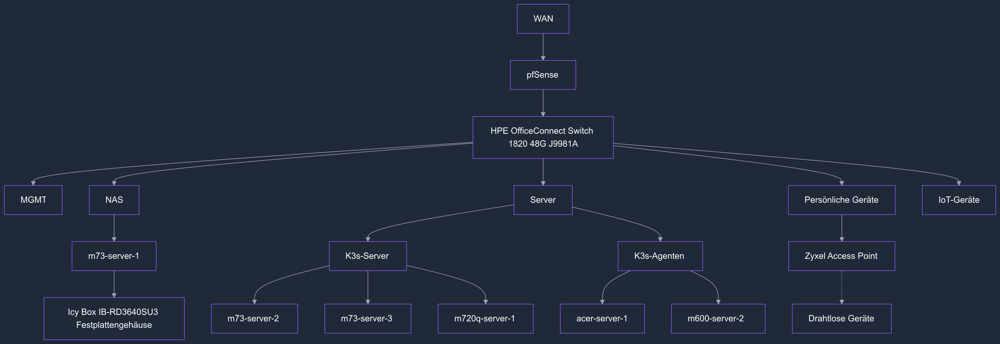

#### Netzwerkdiagramm

## Hardware
### Router
- pfSense
	- HP Prodesk 600 G3 SFF
		- Intel® Core™ i3-7100 CPU @ 3.90GHz
		- 16 GB DDR4
		- 128 GB SSD
		- 1 Gbe on board
		- 1 Gbe TP-Link TG-3468 v3.0
		- 2.5 Gbe Intel I226

### Switch
- hpe-switch-1
	- HPE OfficeConnect Switch 1820 48G J9981A
		- 48 Ports
		- 1 Gbe

### NAS
- m73-server-1
	- Lenovo Thinkcentre M73 Tiny
		- Intel® Core™ i3-4150T CPU @ 3.00GHz
		- 12 GB DDR3
		- 128 GB SSD
		- 1 Gbe on board
		- Icy Box IB-RD3640SU3 4 Bay USB-Festplattengehäuse

### K3s-Server
- m73-server-2
- m73-server-3
	- Lenovo Thinkcentre M73 Tiny
		- Intel® Core™ i3-4150T CPU @ 3.00GHz
		- 12 GB DDR3
		- 128 GB SSD
		- 1 Gbe on board
- m720q-server-1
	- Lenovo Thinkcentre M720q Tiny
		- Intel® Core™ i5-8400T CPU @ 1.70GHz
		- 16 GB DDR4
		- 256 GB SSD
		- 1 Gbe on board

### K3s-Agenten
- acer-server-1
	- Acer Aspire V5-552G
		- AMD A10-5757M
		- 8 GB DDR3
		- 120 GB SSD
		- 1 Gbe on board
- m600-server-2
	- Lenovo Thinkcentre M600 Tiny
		- Intel® Celeron™ N3010 CPU @ 1.04GHz
		- 4 GB DDR3
		- 16 GB SSD
		- 1 Gbe on board